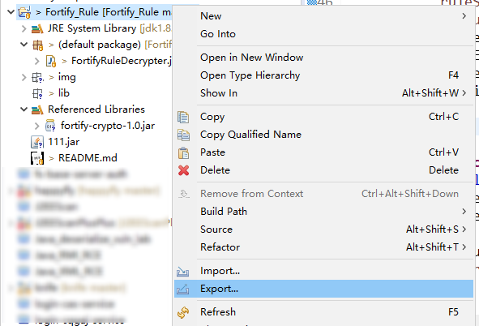
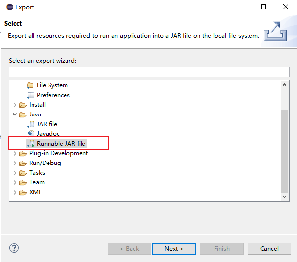
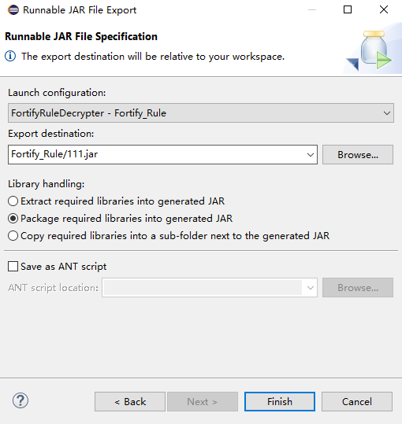
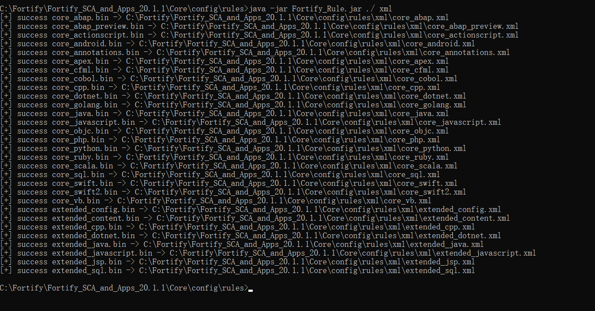
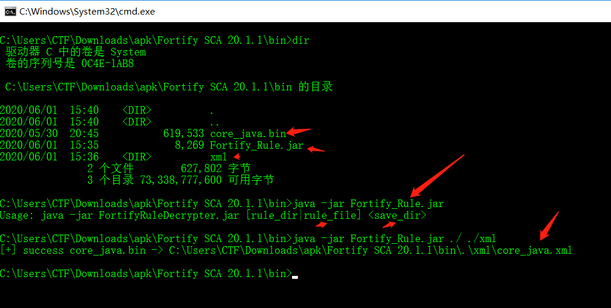
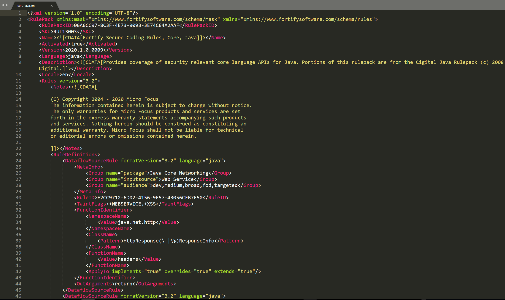

# Fortify_Rule

### 导出Jar包的方法







### Jar包下载

https://github.com/bit4woo/Fortify_Rule/raw/master/FortifyRuleDecrypter.jar


### Decode Fortify Rule Bin File Get XML File



规则解密来自于文章：https://gv7.me/articles/2019/fortify-rule-library-decryption-process/

/Fortify_Rule/com/fortify/util/CryptoUtil.java的代码由/Fortify_Rule/lib/fortify-crypto-1.0.jar反编译而来。原始路径"D:\Program Files\Fortify\Fortify_SCA_and_Apps_20.1.1\Core\lib\fortify-crypto-1.0.jar"


Usage:

```
C:\Users\CTF\Downloads\apk\Fortify SCA 20.1.1\bin>dir
 驱动器 C 中的卷是 System
 卷的序列号是 0C4E-1AB8

 C:\Users\CTF\Downloads\apk\Fortify SCA 20.1.1\bin 的目录

2020/06/01  15:40    <DIR>          .
2020/06/01  15:40    <DIR>          ..
2020/05/30  20:45           619,533 core_java.bin
2020/06/01  15:35             8,269 Fortify_Rule.jar
2020/06/01  15:36    <DIR>          xml
               2 个文件        627,802 字节
               3 个目录 73,338,777,600 可用字节

C:\Users\CTF\Downloads\apk\Fortify SCA 20.1.1\bin>java -jar Fortify_Rule.jar
Usage: java -jar FortifyRuleDecrypter.jar [rule_dir|rule_file] <save_dir>

C:\Users\CTF\Downloads\apk\Fortify SCA 20.1.1\bin>java -jar Fortify_Rule.jar ./ ./xml
[+] success core_java.bin -> C:\Users\CTF\Downloads\apk\Fortify SCA 20.1.1\bin\.\xml\core_java.xml

C:\Users\CTF\Downloads\apk\Fortify SCA 20.1.1\bin>
```



Xml File



